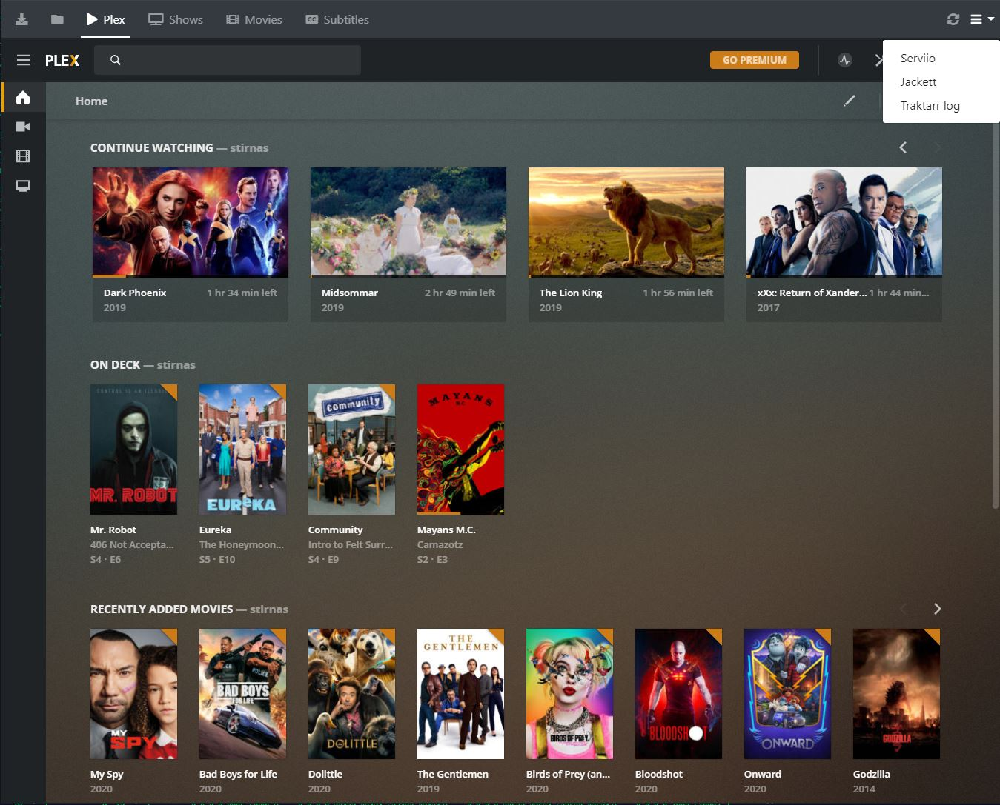

# Automated Home Theater Personal Computer
Currently comes **preconfigured**, just follow setup guide.

### Features:
* Sonarr - v2 https://github.com/Sonarr/Sonarr
* Radarr - https://github.com/Radarr/Radarr
* Bazarr - https://github.com/morpheus65535/bazarr
* Traktarr - https://github.com/l3uddz/traktarr
* Jackett - https://github.com/Jackett/Jackett
* Transmission - https://github.com/transmission/transmission
* Serviio - https://serviio.org/
* Plex - https://www.plex.tv/
* Filebrowser - https://github.com/filebrowser/filebrowser
* Nginx - Custom web interface for easy all service usage
* Watchtower - https://github.com/containrrr/watchtower
* Plex Trakt Scrobbler - https://github.com/trakt/Plex-Trakt-Scrobbler

### Web interface preview:

#### Setup guide:
* git clone https://github.com/IlmLV/htpc.git
* cd htpc
* cp .env.example .env
* update .env to match your setup
* docker-compose up -d
